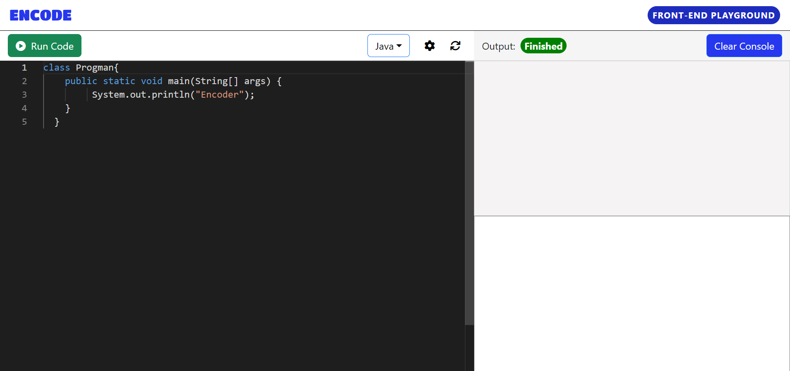

# Encode - Multi-Language Online Code Compiler with Themes

Encode is a dedicated platform designed for coding in multiple languages like Java, Python, and more. It serves as a versatile and user-friendly code compiler.

## Key Features

- Real-time code compilation and execution for instant feedback
- Syntax highlighting and error checking for cleaner and error-free coding
- Supports multiple programming languages, including Java, Python, and more
- Multiple themes for personalized coding experience

## Technologies Used

- React.js
- Bootstrap
- CodeMirror
- split.js

## Getting Started

1. Clone the repository: `git clone https://github.com/anshphirani/encode.git`
2. Navigate to the project directory: `cd encode`
3. Install dependencies: `npm install`
4. Start the development server: `npm start`

## Live Demo

Explore Encode in action by visiting the [Live Demo](https://anshphirani.github.io/encode/).

## Screenshots

